Практическая работа №1.

**Размещение IT-проекта в интернете с использованием веб-сервисов GitHub и
GitPages.**

**1. Цель работы:** Освоить технологии организации IT-проекта с удалённым
доступом в облачной среде, предоставляемой веб-службами GitHub и GitPages, на
основе системы контроля версий Git.

Разместить средствами GitHub в облачной инфраструктуре рабочие файлы проекта по
написанию реферата и опубликовать через GitPages результаты работы в виде
отчёта.

**2. Оборудование:** Компьютер с ОС Windows 7 и выше, выход в интернет.

**3. Теоретические сведения**

**3.1 Системы управления версиями**

**Система управления версиями** (Version Control System, VCS или Revision
Control System) [3.1], [3.2], [3.3] - программное обеспечение для облегчения
работы с изменяющейся информацией. Система управления версиями позволяет хранить
несколько версий одного и того же документа, при необходимости возвращаться к
более ранним версиям, определять, кто и когда сделал то или иное изменение, и
многое другое. Такие системы наиболее широко используются при разработке
программного обеспечения для хранения исходных кодов разрабатываемой программы.
Однако они могут с успехом применяться и в других областях, в которых ведётся
работа с большим количеством непрерывно изменяющихся электронных документов.

Традиционные системы управления версиями используют **централизованную модель**,
когда имеется единое хранилище (**репозитарий, repository**) документов,
управляемое специальным сервером, который и выполняет большую часть функций по
управлению версиями. Пользователь, работающий с документами, должен сначала
получить нужную ему версию документа из хранилища; обычно создаётся локальная
копия документа, так называемая «рабочая копия». Может быть получена последняя
версия или любая из предыдущих, которая может быть выбрана по номеру версии или
дате создания, иногда и по другим признакам. После того, как в документ внесены
нужные изменения, новая версия помещается в хранилище. В отличие от простого
сохранения файла, предыдущая версия не стирается, а тоже остаётся в хранилище и
может быть оттуда получена в любое время.

Сервер может использовать т.н. **дельта-компрессию** — такой способ хранения
документов, при котором сохраняются только изменения между последовательными
версиями, что позволяет уменьшить объём хранимых данных.

**Распределённые системы управления версиями** используют распределённую модель
вместо традиционной клиент-серверной. Они, в общем случае, не нуждаются в
централизованном хранилище: вся история изменения документов хранится на каждом
компьютере, в локальном хранилище, и при необходимости отдельные фрагменты
истории локального хранилища синхронизируются с аналогичным хранилищем на другом
компьютере.

Когда пользователь такой системы выполняет обычные действия, такие как
извлечение определённой версии документа, создание новой версии и тому подобное,
он работает со своей локальной копией хранилища. По мере внесения изменений,
хранилища, принадлежащие разным разработчикам, начинают различаться, и возникает
необходимость в их синхронизации. Такая синхронизация может осуществляться с
помощью обмена наборами изменений (англ. change sets) между пользователями.

Описанная модель логически близка созданию отдельной ветки для каждого
разработчика в классической системе управления версиями. Отличие состоит в том,
что до момента синхронизации другие разработчики этой ветви не видят. Пока
разработчик изменяет только свою ветвь, его работа не влияет на других
участников проекта и наоборот. По завершении обособленной части работы,
внесённые в ветви изменения сливают с основной (общей) ветвью. Как при слиянии
ветвей, так и при синхронизации разных хранилищ возможны конфликты версий. На
этот случай во всех системах предусмотрены те или иные методы обнаружения и
разрешения конфликтов слияния.

С точки зрения пользователя распределённая система отличается необходимостью
создавать локальный репозиторий и наличием в командном языке двух дополнительных
команд: команды получения репозитория от удалённого компьютера (*pull*) и
передачи своего репозитория на удалённый компьютер (*push*). Первая команда
выполняет слияние изменений удалённого и локального репозиториев с помещением
результата в локальный репозиторий; вторая — наоборот, выполняет слияние
изменений двух репозиториев с помещением результата в удалённый репозиторий. Как
правило, команды слияния в распределённых системах позволяют выбрать, какие
наборы изменений будут передаваться в другой репозиторий или извлекаться из
него, исправлять конфликты слияния непосредственно в ходе операции или после её
неудачного завершения, повторять или возобновлять неоконченное слияние. Обычно
передача своих изменений в чужой репозиторий (*push*) завершается удачно только
при условии отсутствия конфликтов. Если конфликты возникают, пользователь должен
сначала слить версии в своём репозитории (выполнить *pull*), и лишь затем
передавать их другим.

**3.2 Subversion**

**Subversion** [3.4] (также известная как «SVN») — самая распространённая
свободная централизованная система управления версиями, официально выпущенная в
2004 году компанией CollabNet. С 2010 года Subversion является одним из проектов
Apache Software Foundation и официально называется Apache Subversion.

Subversion используется многими сообществами разработчиков открытого
программного обеспечения. В их числе такие известные проекты, как Apache, Free
Pascal, FreeBSD. Subversion также широко используется в закрытых проектах и
корпоративной сфере. Хостинг Subversion, в том числе для проектов с открытым
кодом, также предоставляют популярные хостинг-проекты SourceForge.net,
Tigris.org, Google Code и BountySource. Subversion — централизованная система,
то есть данные хранятся в едином хранилище. Хранилище может располагаться на
локальном диске или на сетевом сервере.

Работа в Subversion мало отличается от работы в других централизованных системах
управления версиями. Клиенты копируют файлы из хранилища, создавая локальные
рабочие копии, затем вносят изменения в рабочие копии и фиксируют эти изменения
в хранилище. Несколько клиентов могут одновременно обращаться к хранилищу. Для
совместной работы над файлами в Subversion преимущественно используется модель
копирование - изменение - слияние. Кроме того, для файлов, не допускающих
слияние (различные бинарные форматы файлов), можно использовать модель
блокирование - изменение - разблокирование.

При сохранении новых версий используется дельта-компрессия: система находит
отличия новой версии от предыдущей и записывает только их, избегая дублирования
данных.

Типичная итерация рабочего цикла с Subversion включает следующие этапы:

1. **Обновление** рабочей копии из хранилища (*svn update*) или её создание
(*svn checkout*).

2. **Изменение** рабочей копии. Изменения каталогов и информации о файлах
производится средствами Subversion, в изменении же (содержимого) файлов
Subversion никак не задействован — изменения производятся программами,
предназначенными для этого (текстовые редакторы, средства разработки и т. п.):

\- новые (ещё не зафиксированные в хранилище) файлы и каталоги нужно
**добавить** (команда *svn add*), то есть передать под управление версиями;

\- если файл или каталог в рабочей копии нужно **удалить, переименовать,
переместить или скопировать**, необходимо использовать средства Subversion (*svn
mkdir, svn delete, svn move, svn copy*);

\- **просмотр состояния** рабочей копии и локальных (ещё не зафиксированных)
**изменений** (*svn info, svn status, svn diff*);

\- любые локальные изменения, если они признаны неудачными, можно **откатить**
(*svn revert*).

3. При необходимости - **дополнительное обновление**, для получения изменений,
зафиксированных в хранилище другими пользователями и слияния этих изменений со
своими (*svn update*).

4. **Фиксация** своих изменений (и/или результатов слияния) в хранилище (*svn
commit*).

**Ветвление** является важным аспектом работы систем управления версиями,
поскольку типичные приёмы управления версиями (по крайней мере, при разработке
программного обеспечения) включают в себя использование ветвей. Subversion
обладает достаточно развитыми возможностями для ветвления и слияния.

Как правило, полный цикл работы с ветвями включает следующие этапы:

1. Создание ветви (*svn copy*);

2. Переключение имеющейся рабочей копии на ветвь (*svn switch*) или создание
новой рабочей копии путём закачки (*svn checkout*);

3. Изменение файлов и каталогов в рабочей копии, фиксация этих изменений (svn
commit);

4. Копирование в ветвь свежих изменений из родительской ветви, сделанных после
ветвления (*svn merge, svn commit*);

5. Копирование изменений из ветви в родительскую ветвь (*svn merge, svn
commit*);

6. Удаление ветви (*svn delete*), если её жизненный цикл закончен.

**Слияние** в Subversion — это применение к ветви набора изменений, сделанных на
другой (или той же самой) ветви. Для осуществления слияния необходимо
использовать команду *svn merge* - она применяет набор изменений к рабочей
копии; затем нужно зафиксировать внесённые изменения (*svn commit*).

**TortoiseSVN** [3.5] - это широко распространённый бесплатный клиент для
системы контроля версий Subversion, выполненный как расширение для проводника
Windows и распространяемый под лицензией GPL.

TortoiseSVN обеспечивает:

\- Интеграция клиента Subversion с оболочкой Windows (функции программы
отображаются в контекстном меню для папок и файлов проводника).

\- Простой доступ к командам Subversion без его установки.

\- Для работы с репозиториями не требуется специальный IDE.

\- Информационные значки на иконках файлов для индикации состояния файла.

\- Версирование папок.

\- Атомарные фиксации.

\- Программа сравнения разных версий файлов из репозитория.

\- Версированные метаданные.

\- Возможность выбора протокола доступа к локальному хранилищу или к хранилищу
по сети.

\- Единый способ обработки данных.

\- Эффективные ветки и метки.

\- На сайте доступно множество версий локализаций пакета.

**3.3 Git**

**Git** [3.2], [3.3], [3.6] - распределённая система управления версиями. Проект
был создан Линусом Торвальдсом для управления разработкой ядра Linux, первая
версия выпущена 7 апреля 2005 года. Среди проектов, использующих Git - ядро
Linux, Swift, Android, Drupal, Cairo, GNU Core Utilities, Mesa, Wine, Chromium,
Compiz Fusion, FlightGear, jQuery, PHP, NASM, MediaWiki, DokuWiki, Qt, ряд
дистрибутивов Linux.

Система спроектирована как набор программ, специально разработанных с учётом их
использования в язык сценариев (scripts). Это позволяет удобно создавать
специализированные системы контроля версий на базе Git или пользовательские
интерфейсы.

Git поддерживает быстрое разделение и слияние версий, включает инструменты для
визуализации и навигации по нелинейной истории разработки. Git предоставляет
каждому разработчику локальную копию всей истории разработки, изменения
копируются из одного репозитория в другой.

Удалённый доступ к репозиториям Git обеспечивается git-демоном, SSH- или
HTTP-сервером. TCP-сервис git-daemon входит в дистрибутив Git и является наряду
с SSH наиболее распространённым и надёжным методом доступа. Метод доступа по
HTTP, несмотря на ряд ограничений, очень популярен в контролируемых сетях,
потому что позволяет использовать существующие конфигурации сетевых фильтров.

Ядро Git представляет собой набор утилит командной строки с параметрами. Все
настройки хранятся в текстовых файлах конфигурации. Такая реализация делает Git
легко портируемым на любую платформу и даёт возможность легко интегрировать Git
в другие системы (в частности, создавать графические git-клиенты с любым
желаемым интерфейсом).

Репозиторий Git бывает локальный и удалённый. Локальный репозиторий — это
подкаталог .git, создаётся (в пустом виде) командой *git init* и (в непустом
виде с немедленным копированием содержимого родительского удалённого репозитория
и простановкой ссылки на родителя) командой *git clone*.

Практически все обычные операции с системой контроля версий, такие, как коммит и
слияние, производятся только с локальным репозиторием. Удалённый репозиторий
можно только синхронизировать с локальным как «вверх» (push), так и «вниз»
(pull).

Наличие полностью всего репозитория проекта локально у каждого разработчика даёт
Git ряд преимуществ перед SVN. Так, например, все операции, кроме push и pull,
можно осуществлять без наличия интернет-соединения.

В Windows-версии (официальная Windows-версия называется mSysGit) используется
пакет mSys - порт POSIX-совместимой командной строки под Windows из проекта
MinGW. Под mSys перенесены все необходимые для Git библиотеки и инструменты, а
также сам Git. При работе с удалёнными репозиториями по протоколу SSL
используется хранилище сертификатов из mSys, а не из Windows.

TortoiseGit [3.7] - визуальный клиент системы управления исходными кодами
программ git для ОС Microsoft Windows. Распространяется по лицензии GNU GPL.

Реализован как расширение проводника Windows (shell extension). Подрисовывает
иконки к файлам, находящимся под управлением Git, для отображения их статуса в
Git.

Пользовательский интерфейс сделан на основе TortoiseSVN, поэтому практически
полностью совпадает с ним, за исключением возможностей, специфичных для Git.

Взаимодействие с системой контроля версий основано на mSysGit, TortoiseGit
использует его внутри себя, и требует его установки на машину.

**3.4 GitHub**

GitHub [3.8] - крупнейший веб-сервис для хостинга IT-проектов и их совместной
разработки.

Веб-сервис основан на системе контроля версий Git и разработан на Ruby on Rails
и Erlang компанией GitHub, Inc (ранее Logical Awesome). Сервис бесплатен для
проектов с открытым исходным кодом и (с 2019 года) небольших частных проектов,
предоставляя им все возможности (включая SSL). 4 июня 2018 года Microsoft купила
GitHub за 7,5 млрд долларов.

Создатели сайта называют GitHub «социальной сетью для разработчиков».

GitHub - это облачная платформа, опирающаяся на технологию Git. Она упрощает
совместную работу над проектами, предоставляя веб-сайт, инструменты командной
строки и общий рабочий процесс, позволяющий разработчикам и пользователям
взаимодействовать друг с другом. GitHub выступает в качестве "удаленного
репозитория".

Кроме размещения кода, участники могут общаться, комментировать правки друг
друга, а также следить за новостями знакомых.

С помощью широких возможностей Git программисты могут объединять свои
репозитории — GitHub предлагает удобный интерфейс для этого и может отображать
вклад каждого участника в виде дерева.

Для проектов есть личные страницы, небольшие Вики и система отслеживания ошибок.

**3.4 GitPages**

GitHub Pages-[3.9], [3.10] - это статический веб-хостинг, предлагаемый GitHub с
2008 года пользователям GitHub, для размещения блогов пользователей, проектной
документации или даже целых книг.

Все содержимое GitHub Pages хранится в репозитории Git либо в виде файлов
HTML/CSS/JS, либо в формате языка разметки Markdown. GitHub легко интегрируется
с генератором статических веб-сайтов и блогов Jekyll и конвейерами непрерывной
интеграции GitHub. Каждый раз, когда источник контента обновляется, Jekyll
регенерирует веб-сайт и автоматически обслуживает его через инфраструктуру
GitHub Pages.

Как и остальная часть GitHub, он включает в себя как бесплатные, так и платные
сервисы, а не поддерживается веб-рекламой. Веб-сайты, созданные с помощью этой
службы, размещаются или в поддомене домена github.io, или в домене пользователя,
купленном у стороннего регистратора доменных имен.

Ссылки:

[3.1]
[https://ru.wikipedia.org/wiki/Система_управления_версиями](https://ru.wikipedia.org/wiki/%D0%A1%D0%B8%D1%81%D1%82%D0%B5%D0%BC%D0%B0_%D1%83%D0%BF%D1%80%D0%B0%D0%B2%D0%BB%D0%B5%D0%BD%D0%B8%D1%8F_%D0%B2%D0%B5%D1%80%D1%81%D0%B8%D1%8F%D0%BC%D0%B8)

[3.2] <https://git-scm.com/book/ru/v2>

[3.3] <https://guides.hexlet.io/git-guide/>

[3.4] <https://ru.wikipedia.org/wiki/Subversion>;
<http://svnbook.red-bean.com/index.ru.html>

[3.5] <https://ru.wikipedia.org/wiki/TortoiseSVN>; <https://tortoisesvn.net/>

[3.6] <https://ru.wikipedia.org/wiki/Git>

[3.7] <https://ru.wikipedia.org/wiki/TortoiseGit>; <https://tortoisegit.org/>

[3.8] <https://ru.wikipedia.org/wiki/GitHub>; <https://github.com/>

[3.9] <https://pages.github.com/>

[3.10]
<https://zen.yandex.ru/media/nuancesprog/kak-sozdat-besplatnyi-sait-na-github-pages-5e8b575f41638c101f61d55a>

**4. Порядок выполнения.**

**4.1 Размещение файлов проекта на GitHub [4.1]**

**4.1.1 Создание репозитория на GitHub**

1. Зарегистрируйтесь на [GitHub](https://github.com/). Для этого вам понадобится
рабочий адрес e-mail.

Чтобы начать работать с сервисом GitHub, нужно иметь на нём активированный
аккаунт. Если аккаунта нет, то необходимо его создать. Для этого переходим на
[страницу регистрации GitHub](https://github.com/join).

На странице регистрации вам предложат ввести обязательные данные, которые
необходимо запомнить:

>   \- имя пользователя;

>   \- адрес электронной почты;

>   \- пароль,

и нажать кнопку «Create Account».

**В имени пользователя и пароле используйте только буквы латиницы, знаки тире и
подчёркивания.**

После на указанную ранее почту придёт письмо с просьбой подтвердить электронный
адрес. Для завершения регистрации пройдите по полученной ссылке. Аккаунт для
GitHub создан, всё готово к дальнейшей работе.

2. После регистрации и входа в GitHub нужно создать репозиторий: для рабочих
файлов реферата и для страницы веб-сайта работы.

Для этого прейдите по ссылке [Create a new repository](https://github.com/new) и
создайте новый общедоступный (public) репозиторий для рабочих файлов с именем,
привязанным к названию вашей работы, например «devops-report», «virt-report»,
«my-report». Имя репозитория должно быть написано латиницей без пробелов. При
создании репозитория добавьте также README файл и файл лицензии «The Unlicense».

**4.1.2 Установка и настройка Git и TortoiseGit**

1. Скачайте с сайта <https://gitforwindows.org/> «Git for Windows» и установите
его, приняв все значения по умолчанию.

Если вы хотите поддержать движение BLM, то выберите название «main» для основной
ветви разработки:

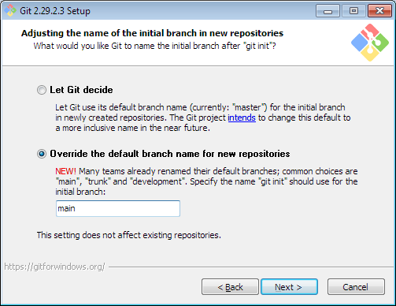

3. Скачайте с сайта <https://tortoisegit.org/download/> «TortoiseGit 64-bit» и
«Russian Language Pack 64 Bit» и установите их, введя имя пользователя и адрес
электронной, установив русский язык в качестве рабочего и приняв все остальные
значения по умолчанию.

4. Создайте папку на жёстком диске, где будут хранится ваши рабочие репозитории
(файлы, с которыми вы будете работать), и клонируйте в неё рабочие репозитории с
GitHub. Для этого в проводнике на свободной области в этой папке кликните правой
клавишей мыши и выберите «Git Клонировать…»:

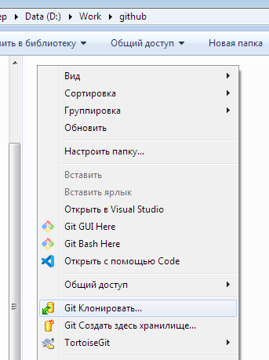

Затем в окне «Git Клонировать» введите путь до репозитория на GitHub и нажмите
кнопку «OK»:

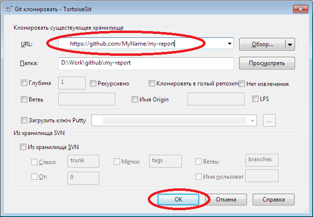

5. Настройте параметров доступа к репозиторию на GitHub. Для это кликнете правой
кнопкой мыши на вновь созданную папку проекта в рабочей папке \\my-report и
выберите «TortoiseGit-\>Настройки»:

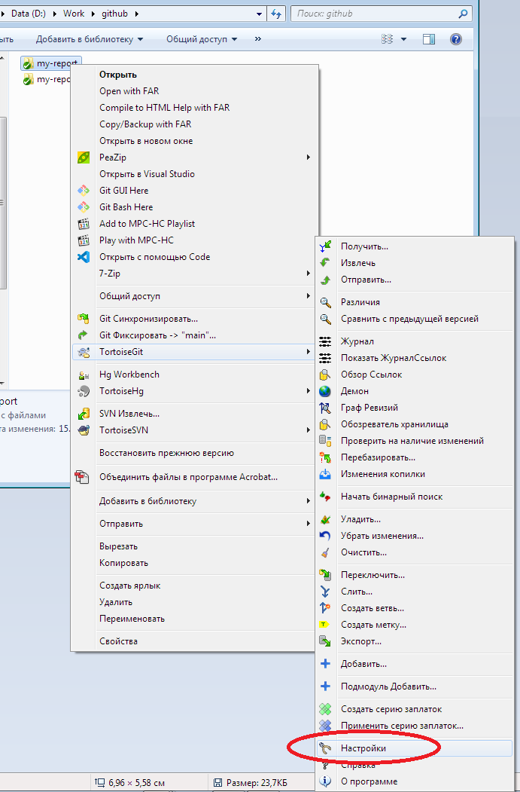

В поле «URL» внешнего хранилища «origin» раздела «Git-\>Внешнее» дополните
строку именем пользователя и паролем аккаунта GitHub в виде
«MyName:MyPassword\@»/

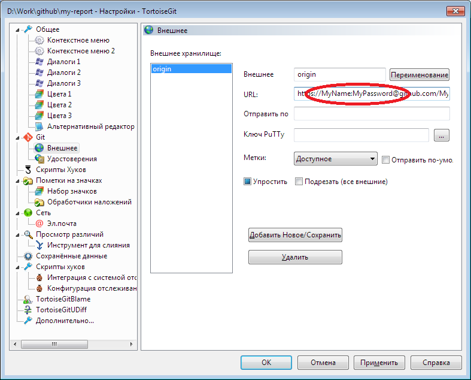

После этого вы сможете синхронизировать репозитории на вашем компьютере и на
GitHub (выполнять команды Git pull/получить и push/отправить) без повторного
ввода имени пользователя и пароля.

**4.1.3 Добавление, удаление файлов, обновление и синхронизация репозитория**

1. Для добавления файлов в репозиторий, скопируйте их в папку или создайте их в
папке проекта (например, \\my-report). После этого выделите добавляемые файлы,
кликните по ним правой кнопкой мыши и выберите «TortoiseGit-\>Добавить…». В окне
«Добавление Закончено!» нажмите кнопку «ОК»:

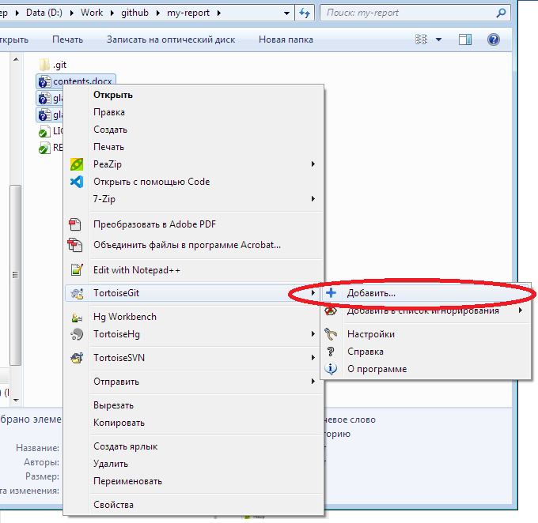

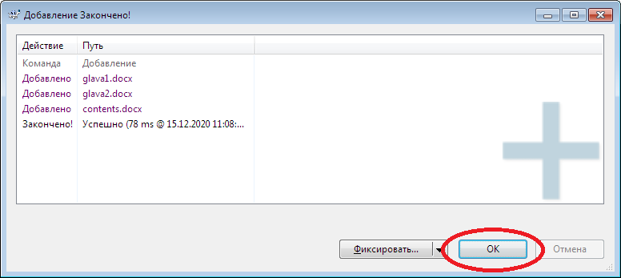

2. Для удаления файлов из репозитория, выделите удаляемые файлы, кликните по ним
правой кнопкой мыши и выберите «TortoiseGit-\>Удалить» или
«TortoiseGit-\>Удалить (оставив локально)»:

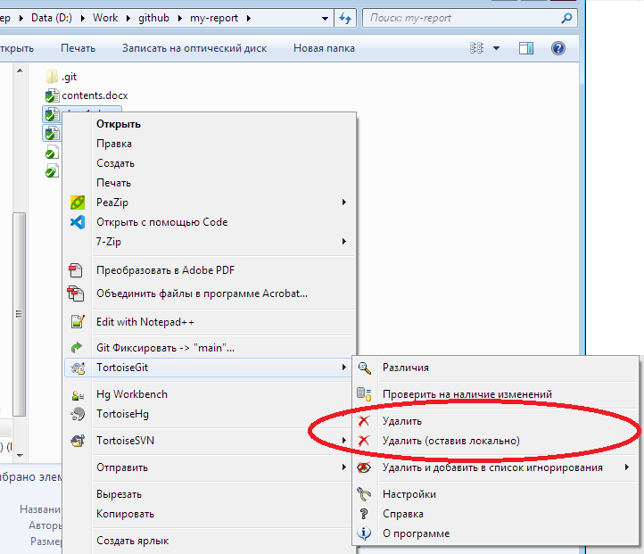

3. Для просмотра сделанных изменений в репозитории кликните правой кнопкой мыши
на папку проекта \\my-report и выберите «Различия», если вы хотите просмотреть
только сделанные вами изменения, или выберите «Проверить на наличие изменений»,
если хотите просмотреть правки, сделанные всеми пользователями:

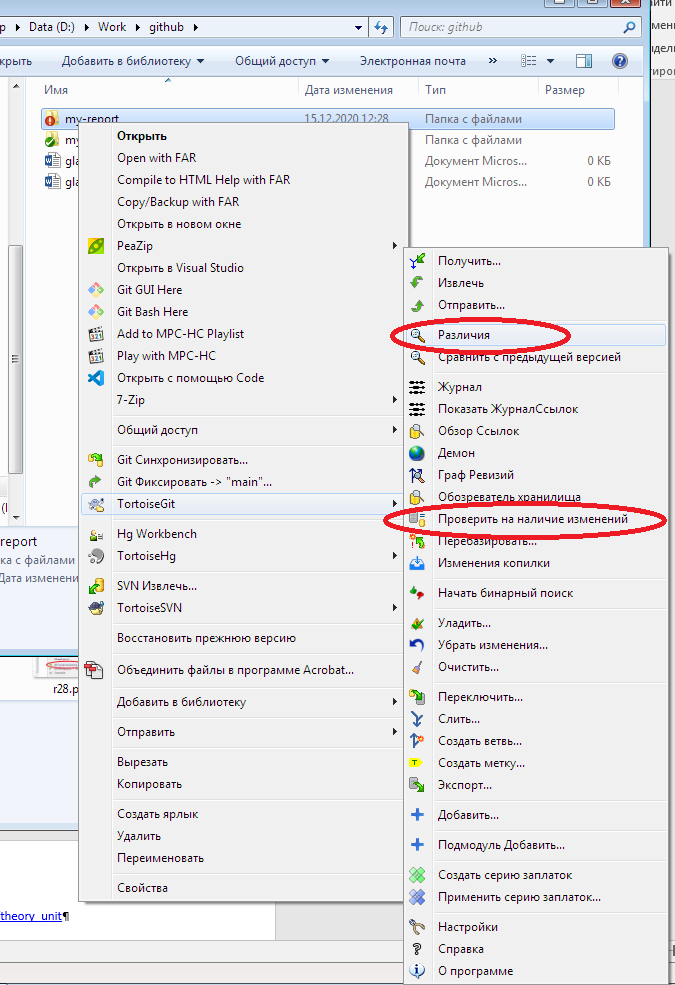

Для просмотра сделанных изменений в файлах в окне «Рабочая копия» двойным кликом
по строкам в списке изменений запускайте программы просмотра изменений:

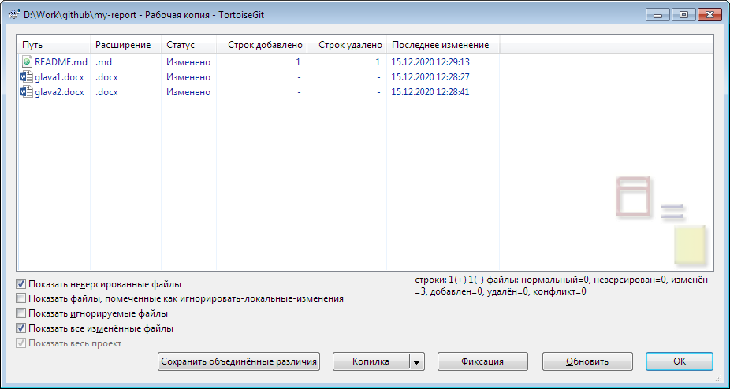

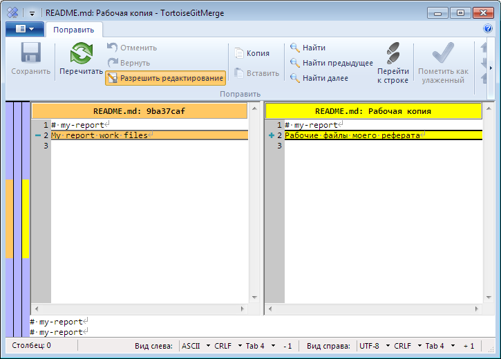

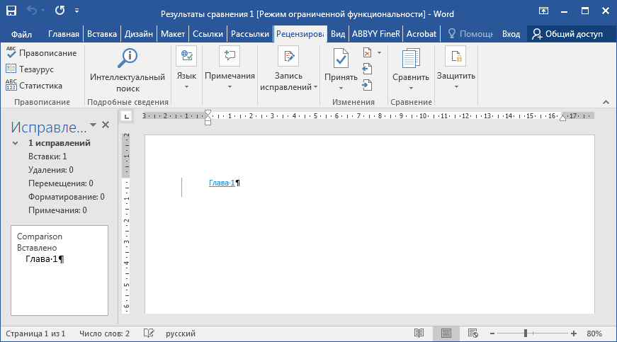

4. Для обновления (фиксации, commit) локального рабочего репозитория после
добавления, удаления и/или изменения файлов, кликните правой кнопкой мыши на
папку проекта \\my-report и выберите «Git Фиксировать \> “main”…». В окне
«Фиксация» введите текст сообщения о правках и нажмите кнопку «Фиксировать»:

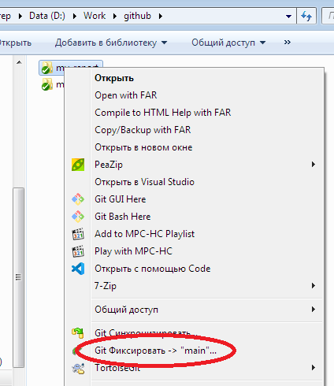

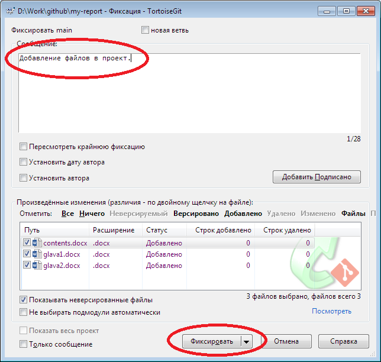

Затем в окне «Прогресс выполнения команды git» нажмите кнопку «Закрыть»:

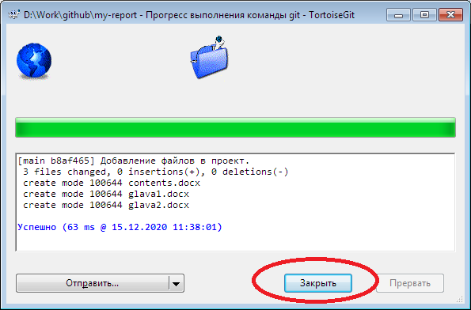

5. Для передачи или получения изменений в репозиторий на GitHub (синхронизация)
кликните правой кнопкой мыши на папку проекта \\my-report и выберите «Git:
Синхронизировать…». В окне «Git: Синхронизация» нажмите кнопку «Получить» (pull)
или «Отправить» (push) для синхронизации локального и удалённого репозиториев.
Затем нажмите кнопку «Закрыть»:

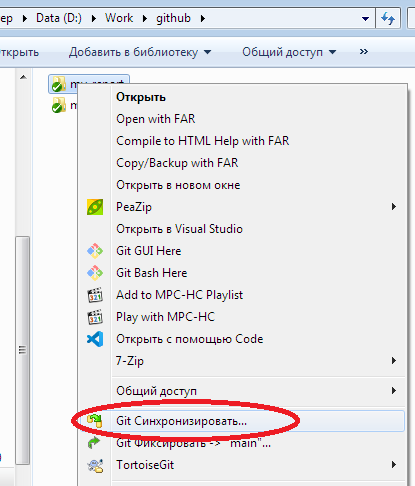

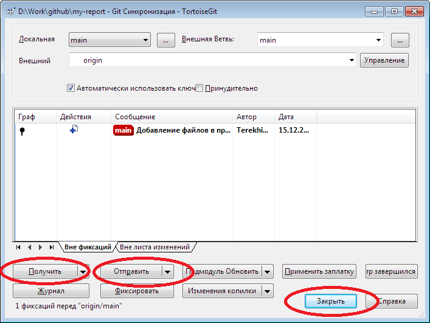

На странице репозитория GitHub https://github.com/MyName/my-report убедитесь,
что изменения приняты.

**4.2 Публикация работы на GitPages**

1. Зайдите в свой GitHub-репозиторий https://github.com/MyName/my-и нажмите
Settings [4.4].

Прокрутите страницу вниз до раздела «GitHub pages». Теперь в выпадающем меню
«Source» выберите «master branch» или «master branch/docs folde»r. Разница в
том, что если вы будете размещать проект из папки docs, то эта папка (docs)
обязательно должна присутствовать в ветке main (master), из которой запускается
сайт.

Здесь же вы можете выбрать («Theme Chooser») тему для вашей страницы, если она
создаётся из файла **README.md**.

Далее последует уведомление, что сайт https://MyName.github.io/my-report/ готов
к размещению. Он будет автоматически сгенерирован из файла **README.md** в
основной ветке вашего проекта.

Если вы поместите в основную ветку вашего проекта файл **index.html**, то сайт
будет автоматически сгенерирован из него.

Сайт работы будет доступен по ссылке **https://MyName.github.io/my-report/.**

Для того, чтобы создать общий сайт для вашего аккаунта, нужно создать
репозиторий с именем **myname.github.io** с файлом README.md. Если работа
GitPages активирована, то сайт будет доступен по адресу
<https://myname.github.io>.

Страницы сайта будут автоматически генерироваться либо из файла index.html, либо
из файла README.md. В первом случае используется обычная технология статического
сайта **HTML/CSS/JS**. Во втором случае используется технология на основе языка
разметки **Markdown**.

2. В качестве теории для разработки статического сайта HTML/CSS/JS можете
воспользоваться уроками из курсов [4.5], [4.6].

3.

Ссылки:

[4.1] <https://ru.hexlet.io/courses/intro_to_git>

[4.2] <https://ru.hexlet.io/courses/intro_to_git/lessons/setup/theory_unit>

[4.3] <https://gitforwindows.org/>

[4.4] [Как создать бесплатный сайт на GitHub
Pages](https://medium.com/nuances-of-programming/%D0%BA%D0%B0%D0%BA-%D1%81%D0%BE%D0%B7%D0%B4%D0%B0%D1%82%D1%8C-%D0%B1%D0%B5%D1%81%D0%BF%D0%BB%D0%B0%D1%82%D0%BD%D1%8B%D0%B9-%D1%81%D0%B0%D0%B9%D1%82-%D0%BD%D0%B0-github-pages-e0f3c258ee22)

[4.5] <https://ru.hexlet.io/courses/intro_to_web_development>

[4.6] <https://ru.hexlet.io/courses/html>
